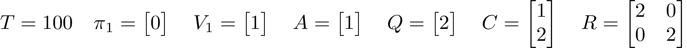
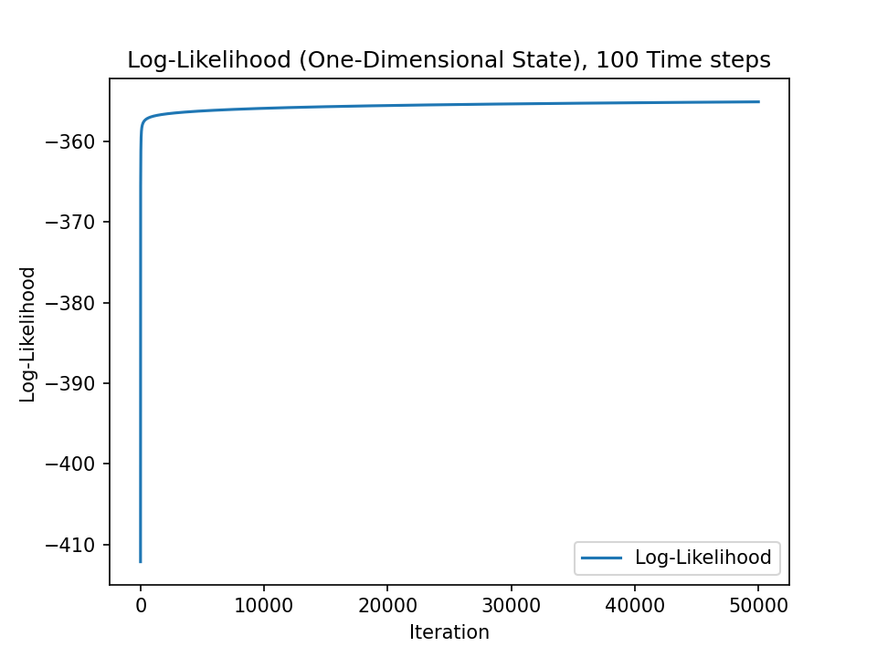
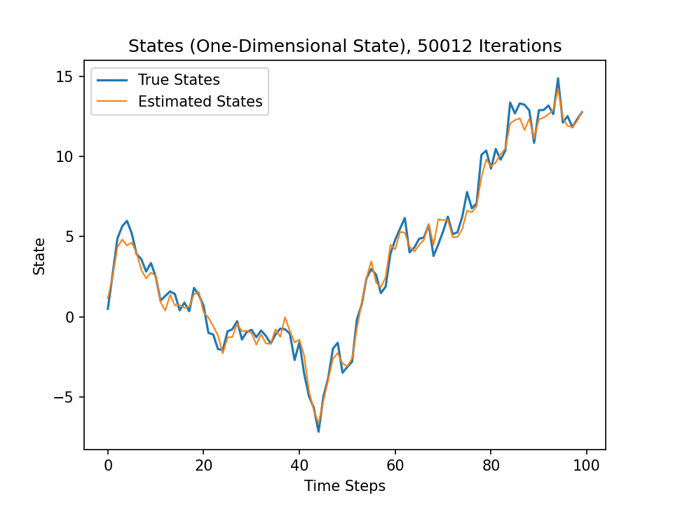
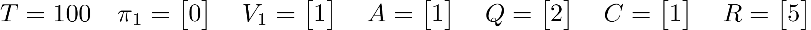
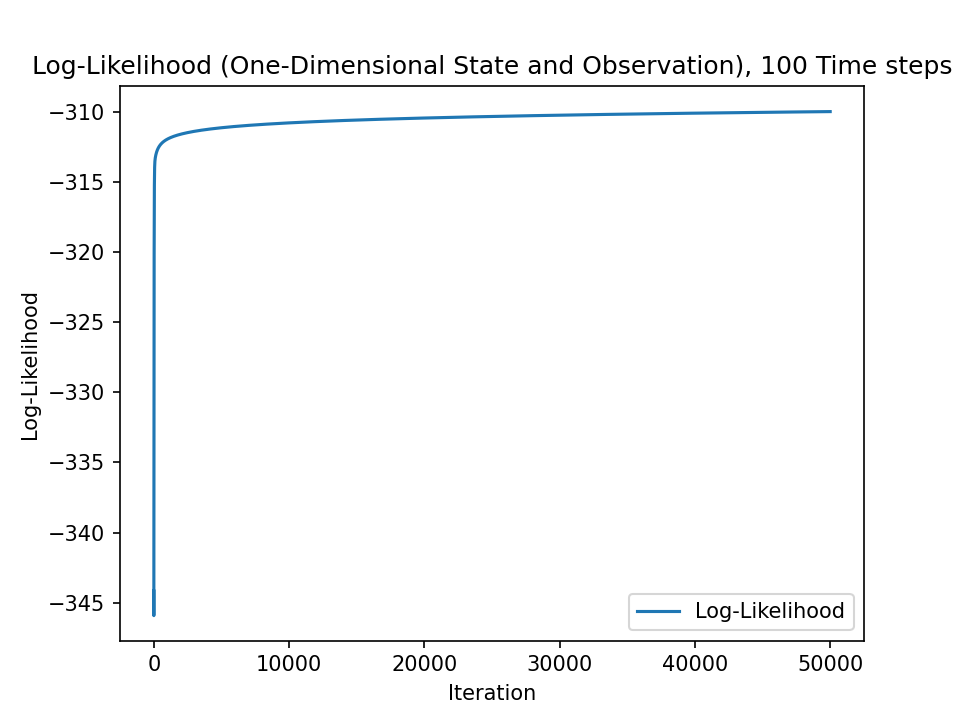
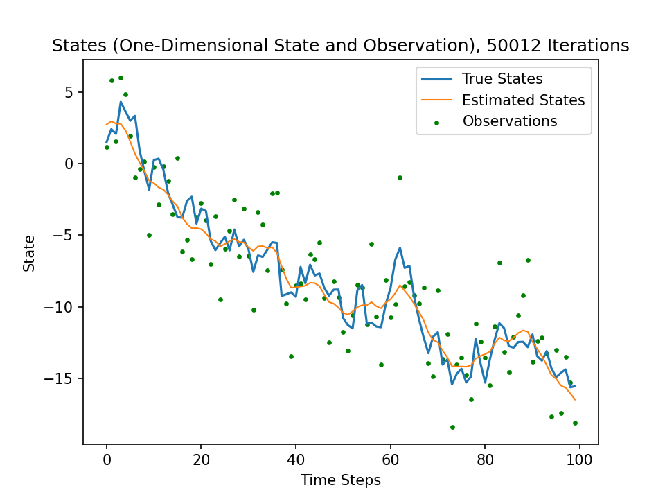

# Implementation of Paper "Parameter Estimation for Linear Dynamic Systems"

This is an implementation of the EM algorithm described in the paper [Parameter Estimation for Linear Dynamic Systems by Ghahramani and Hinton][GH96].

All formulas referenced only by a number reference to the above paper.

## Results

There were three experiments (multi-dimensional, one-dimensional state and one-dimensional state and observation) done, of which
the raw results can be found in in [results](results) directory (except for the multi-dimensional case, see below). All
experiments were run independently (with the `enabled` flag being set to `True` mutably exclusive).

### Multi-Dimensional

The multi-dimensional experiment leads to singular matrices and negative determinants in the log-likelihood calculation. This is
due to some implementation error that is not yet fixed.

### One-Dimensional State

The states (and observations) were generated using the following parameters:

The algorithm converged after 50012 iterations. The following plot shows the behavior of the log-likelihood vs. the iterations:

The following plot shows the true and the estimated state vs. the time steps:

### One-Dimensional State and Observation

The states (and observations) were generated using the following parameters:

The algorithm converged after 50012 iterations. The following plot shows the behavior of the log-likelihood vs. the iterations:

The following plot shows the true and the estimated state vs. the time steps:

[GH96]: https://pdfs.semanticscholar.org/2e31/70f91e1d8037f8ba03286fa5ddd347a0b88e.pdf
