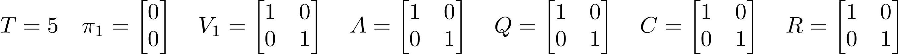
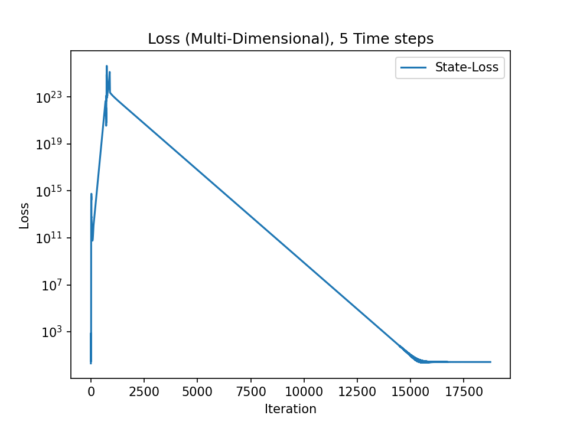
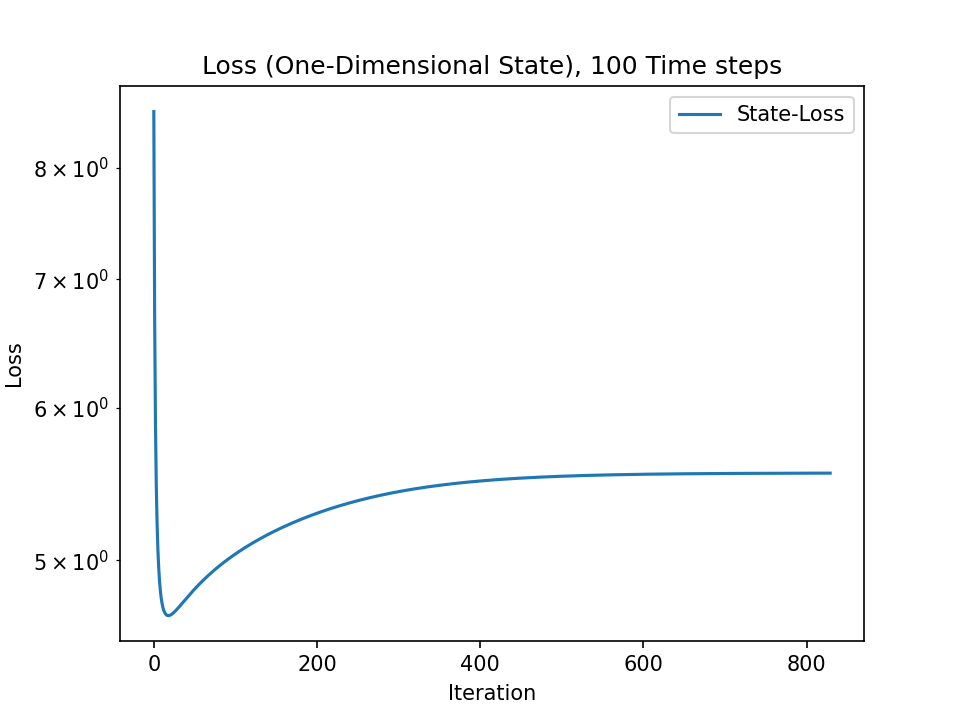
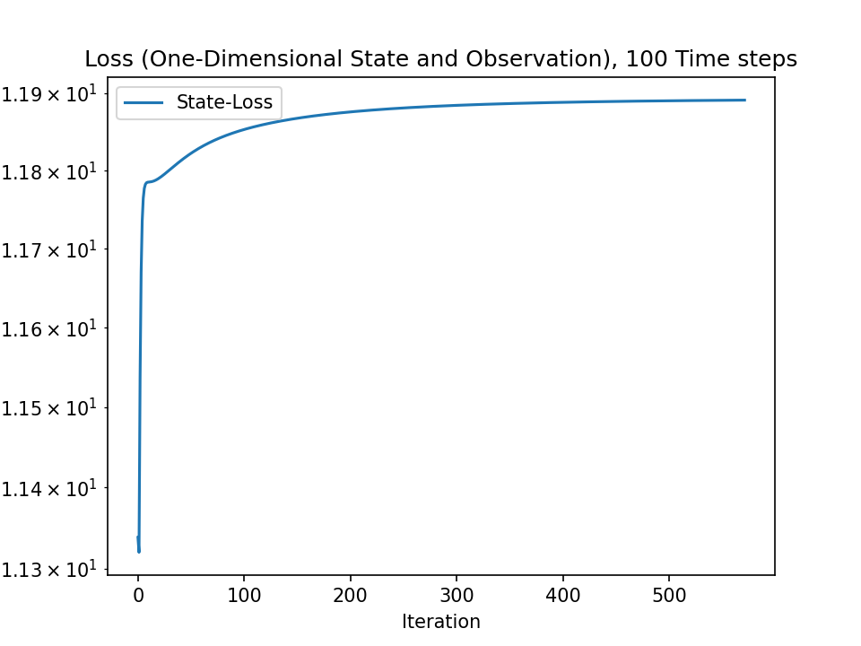

# Implementation of Paper "Parameter Estimation for Linear Dynamic Systems"

This is an implementation of the EM algorithm described in the paper [Parameter Estimation for Linear Dynamic Systems by Ghahramani and Hinton][GH96].

All formulas referenced only by a number reference to the above paper.

## Results

There were three experiments (multi-dimensional, one-dimensional state and one-dimensional state and observation) done, of which
the raw results can be found in in [results](results) directory.

### Multi-Dimensional

The states (and observations) were generated using the following parameters:

The algorithm converged after 18739 iterations with a final x-loss of approx. 2.67. The following plot shows the behavior of the
loss vs. the iterations:

### One-Dimensional State

The states (and observations) were generated using the following parameters:

The algorithm converged after 830 iterations with a final x-loss of approx. 5.55. The following plot shows the behavior of the
loss vs. the iterations:

The following plot shows the true and the estimated state vs. the time steps:

### One-Dimensional State and Observation

The states (and observations) were generated using the following parameters:

The algorithm converged after 572 iterations with a final x-loss of approx. 11.89. The following plot shows the behavior of the
loss vs. the iterations:

The following plot shows the true and the estimated state vs. the time steps:

[GH96]: https://pdfs.semanticscholar.org/2e31/70f91e1d8037f8ba03286fa5ddd347a0b88e.pdf
